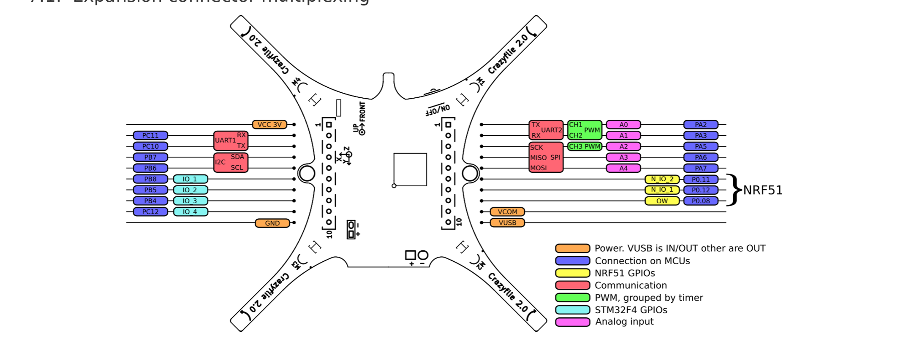
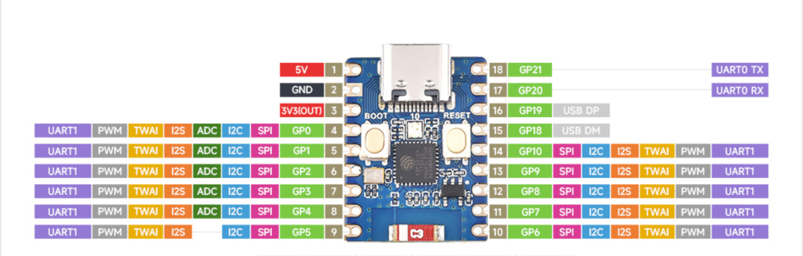
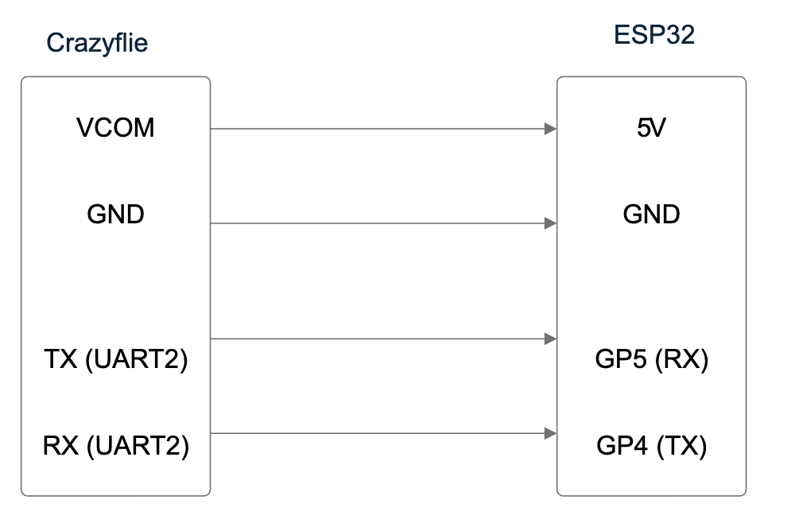

Everything here was done on an M1 mac with a crazyflie 2.1
# Goals
- [x] Flash Arducopter firmware to Crazyflie
- [x] Communicate to ground station (wired)
- [x] Connect to Crazyflie with a radio
- [ ] Connect to Ground station by radio
- [x] Connect Crazyflie to ground station via esp32
- [x] Complete configuration on the methodic configurator
- [x] Clean up the hardware
- [x] Implement the L1 controller onto the crazyflie
- [ ] Adapt the L1 controller to be usable as a flight mode
- [ ] Allow positioning via bitcraze flowdeck
# Flashing the firmware to Crazyflie
- Install QGroundControl
- Install STM32 Programmer
- Download the Arducopter firmware for the crazyflie [firmware](https://firmware.ardupilot.org/Copter/stable-4.5.7/crazyflie2/)
- Download the <u>arducopter with bl.hex</u> file
- Disconnect battery from the Crazyflie
- plug connection cable into computer
- Hold down power button
- Keep button pressed while plugging in the cable to the Crazyflie
- Keep the button pressed for five seconds and then the Crazyflie should have a single blinking blue light and should show up in lsusb as STMicroelectronics STM32 BOOTLOADER
- In the STM32CubeProgrammer
	- Select USB as the connection option
	- Choose the correct port, if no port is shown Crazyflie is not in DFU mode, redo the previous steps on the Crazyflie
	- click connect
	- Open the hex file downloaded earlier
	- click download to flash it to the drone and then restart the crazyflie
# Communicate to the Crazyflie wired
- Connect the micro usb and launch QGroundControl, this should show that the drone has been connected the ground station
# Using the Crazyradio to communicate
- The goal here was to see if communication to the Crazyflie could still be done with the Crazyradio
- First we install libusb,
```
brew install libusb
```
- Next we will clone the [crazyflie-python-lib](https://github.com/bitcraze/crazyflie-lib-python)  repo
```
git clone https://github.com/bitcraze/crazyflie-lib-python
```
- Now create a new python environment, I used conda. on macOS, python 3.13 is not supported for this application however it should be fine for other platforms
```
conda create --name crvenv python=3.12
```
- Now we will install the dependencies
```
cd crazyflie-lib-python
pip install -e .
```
- After a successful installation we can then move to the examples folder and run the python script, make sure to turn your Crazyflie on and have the radio plugged in
```
cd examples
python cfbridge.py
```
- The terminal should now print: Connected to ...
- This confirms we can connect to the Crazyflie flashed with Arducopter with a Crazyradio
- The issue still remains of having the nrf reciever communicate with the FC which may and having the radio communicate the GCS signals
# Connecting to the ground station via esp32
- We now decided to try to connect to the crazyflie using an [esp32 c3 zero](https://www.waveshare.com/wiki/ESP32-C3-Zero)
- After that we flashed the esp32 with dronebridge using the guide found [here](https://dronebridge.gitbook.io/docs/dronebridge-for-esp32/untitled)
- Then for configuration we put pin 4 as tx and pin 5 as rx and ran the drone in access point mode with a baud rate of 115200 with mavlink communication
- The wiring was done with reference to the following two diagrams

- Make sure to use the pin numbers shown in green for configuring drone bridge
- For the serial communication we used the UART2 pins
- The connections were done as follows, VCOM on crazyflie $\longleftrightarrow$ 5V on esp32, GND $\longleftrightarrow$ GND, UART2 TX $\longleftrightarrow$ RX (GP5), and finally UART2 RX $\longleftrightarrow$ TX (GP4) As shown in the diagram bellow

- After performing this wiring the drone would not connect to the ground station
- To eliminate the possibility of the esp32 causing the errors we attached a serial to usb connected to the Crazyflies TX and RX pins
- After some debugging the issue was found to be with the serial communication settings of the flight controller
- Connecting to the crazyflie by usb and then going into the parameters section and then the serial parameters, set every protocol to MAVLINK 2 and the baud rates to 115200
- After this the crazyflie should connect via the serial to usb chip and the esp32 to the ground control 
- Now we must disable some safety checks since the crazyflie is missing a compass and other hardware and now it is ready to fly
# Methodic Configurator
- After some testing it appears that the telemetry is attached to serial 3 since changing the baud rate of serial 3 makes it so we cannot connect to the esp32 anymore
- Most parameters were either calculated by the methodic configurator, set to default or taken from the diatone mxc taycan template
- Set the slew rates to 25, will see if this is a good decision, after flight testing it seemed to have improved the control
- We may want to change the SCHED_LOOP_RATE parameter
- Here are some parameters we may want to look into later
	- SCHED_LOOP_RATE
	- MOT_SPIN_ARM
	- MOT_SPIN_MIN
	- MOT_THST_EXPO
	- All the notch filter stuff
- Config flies pretty well, no more constant yaw
- Make sure to disable geofence or the crazyflie will not arm
# Implement L1 controller
- First clone the repo into a folder add and the submodules  by doing the following 
```
git clone https://github.com/sigma-pi/L1Quad
cd L1Quad
git submodule update --init --recursive
```
- Next we are going to download everything needed for this project
```
conda create --name arducopter python=3.8
conde activate arducopter
xcode-select --install
```
- We want to be using the latest version of g++ so make sure you are not using the px4 package by running and install any other arm-none-eabi installs
```
brew unistall gcc-arm-none-eabi
```
- Now we will install some packages
```
brew update
brew upgrade
brew install genromfs
brew install --cask gcc-arm-embedded
brew install gawk
pip install pyserial
pip install future empy
pip install pyexpect
```
- Now we will add the L1 controller
```
rm ./ardupilot/ArduCopter/Copter.h ./ardupilot/ArduCopter/Parameters.cpp ./ardupilot/ArduCopter/Parameters.h ./ardupilot/ArduCopter/config.h ./ardupilot/ArduCopter/mode.cpp ./ardupilot/ArduCopter/mode.h ./ardupilot/ArduCopter/motors.cpp
```

```
cp ./L1AC_customization/ArduCopter/ACRL_trajectories.cpp ./L1AC_customization/ArduCopter/ACRL_trajectories.h ./L1AC_customization/ArduCopter/mode_adaptive.cpp ./L1AC_customization/ArduCopter/Copter.h ./L1AC_customization/ArduCopter/Parameters.cpp ./L1AC_customization/ArduCopter/Parameters.h ./L1AC_customization/ArduCopter/config.h ./L1AC_customization/ArduCopter/mode.cpp ./L1AC_customization/ArduCopter/mode.h ./L1AC_customization/ArduCopter/motors.cpp ./ardupilot/ArduCopter/
```

- Now if you run
```
cd ardupilot
./waf list_boards
```
- You should get a list of usable boards for the firmware
- Now go to ardupilot/Arducopter/config.h and set **REAL_OR_SITL** to 1
`#ifndef REAL_OR_SITL`
`#define REAL_OR_SITL 1 // 0 for SITL and 1 for REAL`
`#endif`
- And now we run
```
./waf distclean
./waf configure --board crazyflie2
./waf copter
```
- That should compile properly
- Now if you look in ardupilot/build/crazyflie2/bin there will be a .apj file
- To flash the new firmware we open QGroundControl and connect to the crazyflie already flashed with ardupilot via usb
- Next go the firmware tab then unplug and replug the crazyflie
- Now you should see a pop up menu appear
- Select Ardupilot, Chibios, Multirotor, check the advanced settings box and choose custom firmware file then press ok
- Now select the .apj file and flash the crazyflie with ardupilot
- Now upload the parameters for version 4.4.4 and you can now use L1
- To actually use L1 you need to use mavproxy, connect to the crazyflie via usb and run
```
ls /dev/tty.*
```
- Now you will see the port for the crazyflie and use that in the next command
```
mavproxy.py --mavproxy.py --master=/dev/tty.****** --baudrate 115200
```
- This may take a bit to run but once it has you will see text pop up on the screen, hit enter and you should see STABILIZE>
- Now run the following to enter L1 mode
```
mode 29
```
# Flowdeck Positioning
- The goal here is to use the Flowdeck v2 by Bitcraze to have a localization scheme for the crazylfies using the optical flow and lidar range sensors on the deck
- After flashing some custom drivers there appears to be an issue where the sensors sometimes do not initialize properly requiring a reboot
- When the sensors do initialize properly they function as intended
- The z ranger works properly right away however now we need to tune the optical flow deck to properly measure the distance travelled